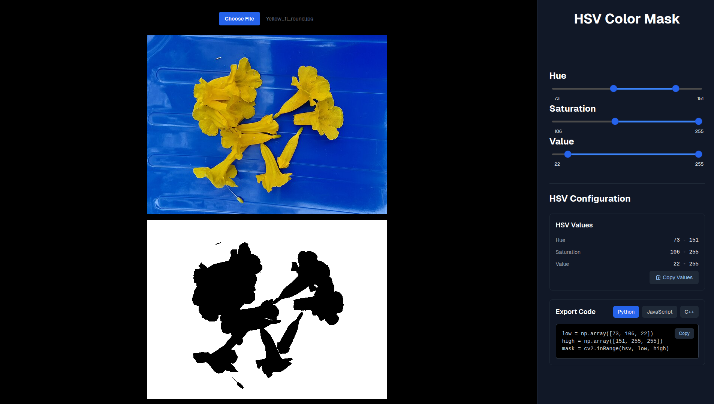

# HSV Color Mask Tool

Simple web-based tool for creating HSV (Hue, Saturation, Value) color masks for image processing. Built with Next.js and OpenCV.js.

Try [Live Demo](https://username.github.io/hsv-mask)



## Overview

The tool allows you to:

- Upload images and apply HSV color range filtering in real-time
- Adjust HSV values with interactive sliders
- Export code snippets for Python, JavaScript, and C++

## Tech Stack

- [Next.js](https://nextjs.org/)
- [OpenCV.js](https://docs.opencv.org/4.10.0/d5/d10/tutorial_js_root.html)
- [Tailwind CSS](https://tailwindcss.com/)

## Getting Started

### Prerequisites

- Node.js (v18 or newer)
- npm or yarn

### Installation

1. Clone the repository:
   ```bash
   git clone https://github.com/username/hsv-mask.git
   cd hsv-mask
   ```

2. Install dependencies:
   ```bash
   npm install
   ```

3. Start the development server:
   ```bash
   npm run dev
   ```

4. Open [http://localhost:3000](http://localhost:3000) in your browser

## How to Use

1. Click the "Choose File" button to upload an image
2. Adjust the HSV sliders to create a mask that isolates the colors you want
3. The preview will update in real-time, showing the resulting mask
4. Once you've created your desired mask, you can copy the HSV values or export code snippets

## License

This project is licensed under the MIT License - see the LICENSE file for details.

## Contributing

Contributions are welcome! Feel free to open issues or submit pull requests.